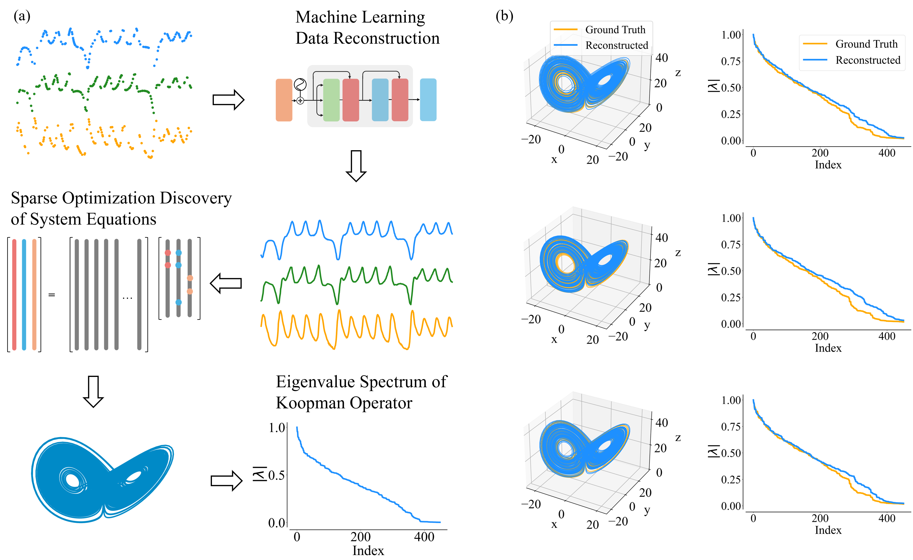
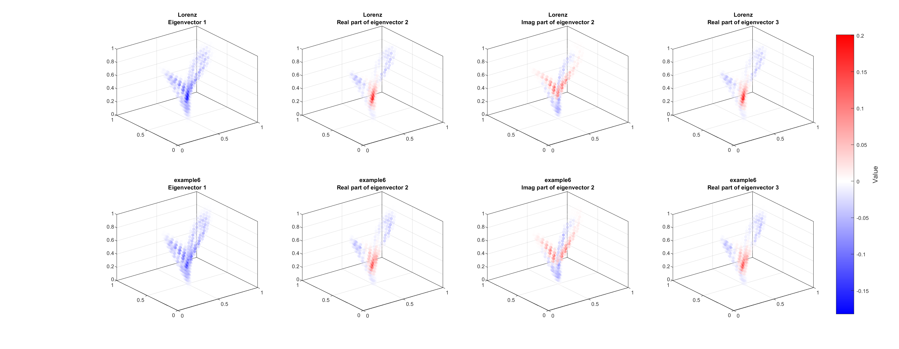

<h1 align="center">Deficiency of equation-finding approach to data-driven modeling of dynamical systems</h1>

This repo is for our preprint [Deficiency of equation-finding approach to data-driven modeling of dynamical systems](https://arxiv.org/abs/2509.03769), where sparse optimization methods can return many different equations from equally plausible measurements of chaotic systems, yet these equations generate virtually identical chaotic attractors, and agree on dominant Koopman spectral features. This nonuniqueness means that "recovered" equations may look interpretable but can be misleading, especially for tasks requiring reliable extrapolation. 

On the left is the workflow of evaluating the accuracy and trustworthiness of the discovered system model in terms of its governing equations found from data, and on the right we demonstrate examples of the equations recovered from the chaotic Lorenz system and the Koopman spectra.

# Simulation guidance

Three dynamical systems are used as examples: the Lorenz, Sprott1, and Sprott13 systems.

• Run `main_<system_name>.m` to perform the Koopman analysis.

• Run `attractor_<system_name>.m` to compute the KL divergence between attractors.

• Run `bifurcation_<system_name>.m` to generate the bifurcation diagrams.

An example comparing Koopman modes for the Lorenz system is shown below.

# More information

- For more information about the sparse-optimization method, specifically SINDy, you can find from this [GitHub page](https://github.com/dynamicslab/pysindy).
- For more information about dynamics reconstruction from sparse observations, you can find from my [Github page](https://github.com/Zheng-Meng/Dynamics-Reconstruction-ML).

If you have any questions or suggestions, feel free to reach out.

# Cite our work

@article{zhai2025deficiency,
  title={Deficiency of equation-finding approach to data-driven modeling of dynamical systems},
  author={Zhai, Zheng-Meng and Lucarini, Valerio and Lai, Ying-Cheng},
  journal={arXiv preprint arXiv:2509.03769},
  year={2025}
}

